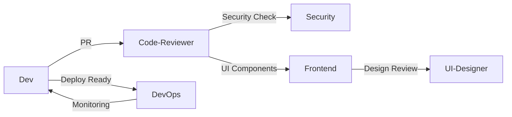
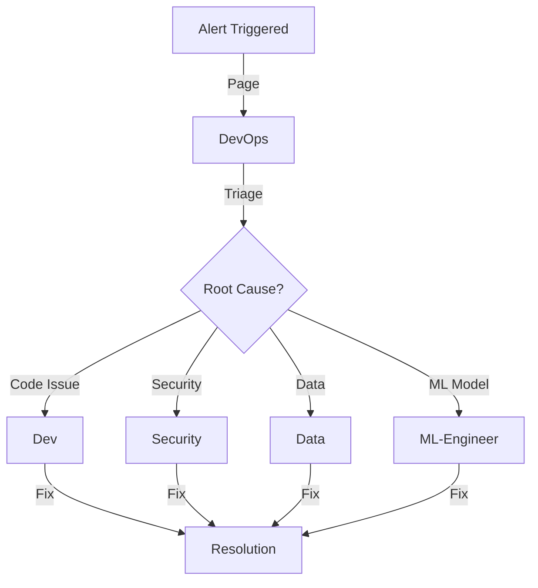
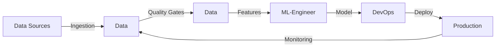

# Cross-Role Contracts Matrix

## Overview
This document defines the contracts and interfaces between different agent roles in Code-Conductor. Each contract specifies inputs, outputs, service level agreements (SLAs), and escalation protocols to ensure smooth collaboration.

## Contract Definitions

### 1. Dev ↔ Code-Reviewer
**Trigger**: Pull request created or updated
**Contract**:
```yaml
provider: code-reviewer
consumer: dev
interface:
  request:
    - pull_request_url: string
    - changed_files: list[string]
    - diff_content: string
  response:
    - review_status: enum[approved, changes_requested, commented]
    - comments: list[{file, line, severity, message}]
    - suggestions: list[{file, line, original, suggested}]
sla:
  initial_review: 15 minutes
  follow_up: 5 minutes
escalation:
  - trigger: no_response_30min
    action: notify_dev_lead
```

### 2. Dev ↔ DevOps
**Trigger**: CI/CD failure or deployment request
**Contract**:
```yaml
provider: devops
consumer: dev
interface:
  ci_failure:
    request:
      - workflow_run_id: string
      - failure_type: enum[build, test, lint, deploy]
      - error_logs: string
    response:
      - root_cause: string
      - fix_actions: list[string]
      - estimated_time: minutes
  deployment:
    request:
      - environment: enum[dev, staging, prod]
      - version: string
      - rollback_plan: object
    response:
      - deployment_url: string
      - health_check_status: object
      - metrics_dashboard: url
sla:
  ci_failure_triage: 5 minutes
  deployment_staging: 10 minutes
  deployment_prod: 30 minutes
```

### 3. Dev ↔ Security
**Trigger**: Security scan findings or code review
**Contract**:
```yaml
provider: security
consumer: dev
interface:
  vulnerability_scan:
    request:
      - scan_type: enum[sast, dast, dependency]
      - target: string
      - priority: enum[critical, high, medium, low]
    response:
      - vulnerabilities: list[{cve, severity, description, fix}]
      - compliance_status: object
      - remediation_plan: object
  code_review:
    request:
      - code_diff: string
      - sensitive_operations: list[string]
    response:
      - security_issues: list[{type, severity, location, fix}]
      - approved: boolean
sla:
  critical_vulnerability: 1 hour
  high_vulnerability: 4 hours
  security_review: 2 hours
```

### 4. Frontend ↔ UI-Designer
**Trigger**: Design implementation or UI review
**Contract**:
```yaml
provider: ui-designer
consumer: frontend
interface:
  design_handoff:
    request:
      - component_name: string
      - design_url: string
      - requirements: list[string]
    response:
      - design_tokens: object
      - accessibility_requirements: list[string]
      - responsive_breakpoints: object
      - animations: list[object]
  ui_review:
    request:
      - component_url: string
      - screenshots: list[url]
    response:
      - visual_diff: object
      - accessibility_score: number
      - performance_metrics: object
sla:
  design_clarification: 2 hours
  ui_review: 4 hours
```

### 5. Data ↔ ML-Engineer
**Trigger**: Feature engineering or data quality issues
**Contract**:
```yaml
provider: data
consumer: ml-engineer
interface:
  feature_engineering:
    request:
      - feature_requirements: list[object]
      - data_sources: list[string]
      - update_frequency: string
    response:
      - feature_table: string
      - schema: object
      - quality_metrics: object
      - lineage: object
  data_quality:
    request:
      - dataset_id: string
      - quality_checks: list[string]
    response:
      - quality_report: object
      - drift_analysis: object
      - recommendations: list[string]
sla:
  feature_delivery: 24 hours
  quality_report: 2 hours
  urgent_fix: 4 hours
```

### 6. Mobile ↔ DevOps
**Trigger**: App build or deployment
**Contract**:
```yaml
provider: devops
consumer: mobile
interface:
  build_request:
    request:
      - platform: enum[ios, android]
      - build_type: enum[debug, release]
      - signing_config: object
    response:
      - build_artifact: url
      - build_logs: url
      - test_results: object
  store_deployment:
    request:
      - platform: enum[ios, android]
      - release_notes: string
      - rollout_percentage: number
    response:
      - submission_id: string
      - review_status: enum[pending, approved, rejected]
      - crash_metrics: object
sla:
  build_completion: 30 minutes
  store_submission: 1 hour
```

## Collaboration Workflows

### 1. Feature Development Flow


### 2. Incident Response Flow


### 3. Data Pipeline Flow


## Communication Protocols

### Synchronous Communication
- **Emergency**: Direct message with @here mention
- **High Priority**: Thread in #team-channel with role mention
- **Normal**: GitHub issue comment or PR review

### Asynchronous Communication
- **Updates**: Daily standup notes in workflow-state.json
- **Documentation**: Markdown files in .conductor/docs/
- **Decisions**: ADRs (Architecture Decision Records)

## Quality Gates

### Code Quality
| Role | Metric | Threshold | Enforcement |
|------|--------|-----------|-------------|
| Dev | Test Coverage | ≥85% | PR Block |
| Dev | Linting | Zero Errors | PR Block |
| Frontend | Lighthouse Score | ≥90 | Warning |
| Mobile | App Size | <100MB | Warning |

### Performance
| Role | Metric | Threshold | Enforcement |
|------|--------|-----------|-------------|
| DevOps | Uptime | ≥99.9% | Alert |
| Frontend | LCP | <2.5s | PR Block |
| ML-Engineer | Inference | <100ms | Alert |
| Data | Pipeline SLA | <5min | Alert |

### Security
| Role | Metric | Threshold | Enforcement |
|------|--------|-----------|-------------|
| All | Critical Vulns | Zero | PR Block |
| Security | OWASP Top 10 | Pass | PR Block |
| DevOps | Secrets in Code | Zero | PR Block |

## Escalation Matrix

### Severity Levels
1. **P0 (Critical)**: Production down, data loss risk
2. **P1 (High)**: Major feature broken, security vulnerability
3. **P2 (Medium)**: Performance degradation, minor feature broken
4. **P3 (Low)**: UI issues, documentation

### Escalation Chain
| Severity | Initial Response | Escalation 1 (30min) | Escalation 2 (2hr) |
|----------|-----------------|---------------------|-------------------|
| P0 | On-call Engineer | Team Lead | Director |
| P1 | Primary Role | Team Lead | Manager |
| P2 | Primary Role | Senior Role | Team Lead |
| P3 | Primary Role | - | - |

## Contract Versioning

### Version Format
`v{major}.{minor}.{patch}`
- **Major**: Breaking changes to interface
- **Minor**: New optional fields or endpoints
- **Patch**: Documentation or SLA updates

### Deprecation Policy
1. Announce deprecation with 30-day notice
2. Support both versions for 14 days
3. Automated migration tools provided
4. Rollback plan required

## Monitoring & Compliance

### SLA Dashboard
```yaml
dashboard:
  url: "/.conductor/metrics/sla-dashboard"
  refresh: 5_minutes
  alerts:
    - sla_breach: email + slack
    - repeated_failure: pagerduty
```

### Monthly Review
- Contract effectiveness metrics
- SLA compliance rates
- Escalation frequency
- Cross-role satisfaction scores

## Amendment Process
1. Propose change via GitHub issue
2. Impact analysis by affected roles
3. 72-hour review period
4. Unanimous approval required
5. Update version and notify all roles